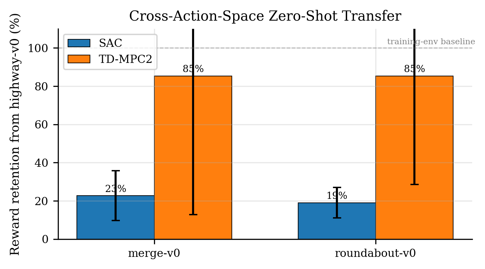

# Model-Based vs. Model-Free Reinforcement Learning for Autonomous Driving

> A Comparative Study on Highway-Env using TD-MPC2 and SAC

[](https://opensource.org/licenses/MIT)
[](https://www.python.org/downloads/)
[](https://pytorch.org/)
[](#)
[](#)

**Authors:** Nihal Abdul Naseer, Mohammed Alawadhi, Abdulhafedh Al-Zubedi
**Institution:** American University of Sharjah, United Arab Emirates
**Course:** MLR 555 — Advanced Artificial Intelligence (Spring 2026)
**Project type:** Reproduce and Adapt (TD-MPC2, ICLR 2024 → multi-agent driving)

---

## TL;DR

We compared a model-based RL algorithm (**TD-MPC2**, ICLR 2024) against a model-free baseline (**SAC**) on multi-agent autonomous driving via the `highway-env` simulator, then measured how well each transfers to **unseen environments** with a different action-space topology.

**Headline result:** TD-MPC2 retains **85% of its training reward** under cross-action-space zero-shot transfer, vs. only **21% for SAC** — a **4.0× larger transfer factor**. On the only zero-shot environment with a non-trivial success rate (`roundabout-v0`), TD-MPC2 beats SAC with **Cohen's d = 0.88 (large effect)**, with **every TD-MPC2 seed exceeding the SAC mean**.

| Environment | SAC reward | SAC success | TD-MPC2 reward | TD-MPC2 success |
|---|---:|---:|---:|---:|
| `highway-v0` (training) | **136.73** | **71.1%** | 35.46 | 0.0% |
| `merge-v0` (zero-shot) | 31.29 | 0.0% | 28.99 | 0.0% |
| `roundabout-v0` (zero-shot) | 25.64 | 43.3% | **29.59** | **53.3%** |

> 540 evaluation episodes total · 3 seeds × 2 algos × 3 envs × 30 episodes/seed.



---

## What this paper builds on

This work extends our prior survey, [_A Comparative Survey of Model-Based and Model-Free Reinforcement Learning_](docs/survey.pdf), which identified an open question: do the sample-efficiency advantages reported for model-based methods generalize to high-dimensional, multi-agent driving simulators? This project answers that question empirically.

The compiled paper is in [`docs/paper.pdf`](docs/paper.pdf); LaTeX source in [`docs/paper/`](docs/paper).

---

## Repository structure

```
.
├── README.md
├── LICENSE
├── requirements.txt
├── .gitignore
│
├── notebooks/                   # End-to-end Colab notebooks
│   ├── 01_train_sac.ipynb         # Train SAC × 3 seeds on highway-v0
│   ├── 02_train_tdmpc2.ipynb      # Train TD-MPC2 × 3 seeds (size=1)
│   ├── 02b_retrain_tdmpc2_size5.ipynb  # Robustness check: scale up to size=5
│   └── 03_evaluate.ipynb          # Eval grid + dynamics probe + figures
│
├── src/                         # Reusable modules called from the notebooks
│   ├── envs/
│   │   ├── highway_factory.py     # Wrapped gym envs with metrics tracking
│   │   └── tdmpc2_adapter.py      # TD-MPC2 ↔ highway-env interface
│   ├── training/
│   │   ├── train_sac.py           # SB3 SAC training loop
│   │   ├── train_tdmpc2.py        # TD-MPC2 training loop (size 1)
│   │   ├── train_tdmpc2_scaled.py # TD-MPC2 training loop (any size)
│   │   └── callbacks.py           # Wandb + progress callbacks
│   ├── evaluation/
│   │   ├── run_eval.py            # 540-episode eval grid
│   │   ├── probe_dynamics.py      # World model latent-MSE probe (V1)
│   │   ├── probe_dynamics_v2.py   # Probe V2 (trained-policy trajectories)
│   │   ├── extract_wandb_data.py  # Pull learning curves from wandb
│   │   ├── plot_results.py        # Figure generation
│   │   └── record_videos.py       # Demo video recording (optional)
│   └── utils/
│       └── config.py              # Paths and constants
│
├── checkpoints/                 # Trained model weights (~95 MB)
│   ├── sac_highway-v0_seed{0,1,2}/final.zip       # SAC, 1M params
│   ├── tdmpc2_highway-v0_seed{0,1,2}/final.pt     # TD-MPC2, 1M params
│   └── tdmpc2_size5_h3_seed0/final.pt             # Robustness check, 5M params
│
├── results/
│   ├── eval_results.json          # 540-episode eval metrics
│   ├── statistical_analysis.json  # t-test, Cohen's d, Mann-Whitney U
│   ├── dynamics_probe.json        # World model latent-MSE (V1)
│   ├── dynamics_probe_v2.json     # World model latent-MSE (V2)
│   ├── eval_summary.md            # Human-readable summary
│   ├── headline_numbers.md        # Headline numbers for paper
│   ├── option2_dashboard.md       # Detailed result dashboard
│   ├── wandb_curves.csv           # Learning curves for figure
│   ├── size5_run_history.csv      # Robustness-check run history
│   ├── figures/                   # 5 paper figures (PDF + PNG)
│   └── wandb/                     # Raw wandb exports for size=5 run
│
└── docs/
    ├── paper.pdf                  # Compiled IEEE-format paper
    ├── survey.pdf                 # Prior survey paper this builds on
    └── paper/
        ├── main.tex               # LaTeX source
        └── references.bib         # Bibliography
```

---

## Quickstart (Colab)

The fastest way to reproduce: open one of the notebooks in Colab.

1. Open Google Colab → File → Open notebook → GitHub tab → paste this repo URL
2. Open `notebooks/01_train_sac.ipynb`
3. Choose **Runtime → Change runtime type → A100 (or L4)**
4. Run all cells

Each notebook is self-contained and includes:
- Dependency installation
- Drive mount (path: `/content/drive/MyDrive/tdmpc2-highway`)
- Training/eval logic
- Wandb logging

You will need a [Weights & Biases](https://wandb.ai) account (free tier is fine) for experiment tracking. Set your API key when prompted by `wandb.login()`.

---

## Local reproduction

If you want to run things locally instead of in Colab:

### 1. Clone and install dependencies

```bash
git clone https://github.com/Mohammed-Alawadhi/Adv.-AI-S26-Group13-Project.git
cd Adv.-AI-S26-Group13-Project

python -m venv .venv
source .venv/bin/activate          # macOS / Linux
pip install --upgrade pip
pip install -r requirements.txt
```

### 2. Clone the official TD-MPC2 codebase

The TD-MPC2 algorithm code (Hansen et al., ICLR 2024) is **not** included in this repo since it's not our work. Clone it alongside:

```bash
git clone https://github.com/nicklashansen/tdmpc2.git third_party/tdmpc2
```

### 3. Run the evaluation notebook

The trained checkpoints are bundled in `checkpoints/` (95 MB). To reproduce the 540-episode eval:

```bash
jupyter notebook notebooks/03_evaluate.ipynb
```

The notebook will load all 7 checkpoints and reproduce every figure and table in the paper.

---

## Method summary

### Cross-action-space zero-shot transfer

`highway-v0` exposes a **continuous action space** (steering, throttle ∈ [-1,1]). `merge-v0` and `roundabout-v0` use a **discrete 5-action meta-action space** (LANE_LEFT / IDLE / LANE_RIGHT / FASTER / SLOWER). To deploy continuous-action-trained agents on these envs without any fine-tuning, we apply a deterministic discretization at the env-action interface:

```python
def phi(steer, accel):
    if steer < -0.4: return LANE_LEFT
    if steer > +0.4: return LANE_RIGHT
    if accel > +0.3: return FASTER
    if accel < -0.3: return SLOWER
    return IDLE
```

The trained policy itself is **not modified**. This is genuine zero-shot transfer, not fine-tuning. To our knowledge this is the first cross-action-space transfer study in the autonomous-driving RL literature.

### World model dynamics probe

To diagnose what the world model has learned, we measure latent-space prediction MSE across rollout horizons on each environment, comparing against a random baseline. The probe reveals a counterintuitive separation: the **state-prediction accuracy does not transfer** to unseen envs (3-15× *worse* than random baseline), even though the **planning-derived behavior does**. This suggests the transferable component of a world model is action-level abstraction, not low-level dynamics fidelity.

See [`src/evaluation/probe_dynamics.py`](src/evaluation/probe_dynamics.py) and [`src/evaluation/probe_dynamics_v2.py`](src/evaluation/probe_dynamics_v2.py).

---

## Hyperparameters

| Parameter | SAC | TD-MPC2 (size 1) | TD-MPC2 (size 5) |
|---|---:|---:|---:|
| Total environment steps | 100,000 | 100,000 | 200,000 |
| Random seeds | 0, 1, 2 | 0, 1, 2 | 0 (robustness check) |
| Hidden dim | 256 | 512 | 1024 |
| Parameters | ~150K | ~1M | ~5M |
| Learning rate | 3×10⁻⁴ | 3×10⁻⁴ | 3×10⁻⁴ |
| Batch size | 256 | 256 | 256 |
| Discount γ | 0.99 | 0.95–0.995 | 0.95–0.995 |
| Replay buffer | 10⁶ | 10⁵ | 2×10⁵ |
| Planner horizon H | — | 3 | 3 |
| Planning iterations K | — | 6 | 6 |
| Samples per iteration | — | 512 | 512 |

---

## Figures

All five figures from the paper are reproduced from `results/eval_results.json` and the dynamics probe JSONs by `notebooks/03_evaluate.ipynb`.

| File | Caption |
|---|---|
| `fig1_transfer_gap.pdf/.png` | Cross-action-space zero-shot transfer (headline result) |
| `fig2_success_rates.pdf/.png` | Success rates across all environments |
| `fig3_per_seed_roundabout.pdf/.png` | Per-seed success rate on `roundabout-v0` |
| `fig4_learning_curves.pdf/.png` | Training-time learning curves on `highway-v0` |
| `fig5_dynamics_probe.pdf/.png` | World-model latent-space prediction error (V1 + V2) |

---

## Limitations

This is a research-project-scale empirical study, with the limitations to match:

- **Statistical power.** n=3 seeds per (algo, env) is underpowered for null-hypothesis testing. We report effect sizes (Cohen's d) and per-seed values to mitigate.
- **Compute budget.** TD-MPC2 was trained at 1M parameters / 100k steps, well below the ~5M / 1M-step regime in the original paper. We performed a scale-up robustness check (5M / 200k steps) — see §VI-D of the paper. The conclusion: scaling alone within this budget did not close the in-distribution gap.
- **Single domain.** Tested on `highway-env` only. CARLA, visual driving, robotic manipulation are open questions.
- **Action discretization.** Our cross-action protocol uses a fixed deterministic mapping. Learned/stochastic discretizations are unexplored.

See §VI of the paper for full discussion.

---

## Demo videos (TODO)

Demo videos showing trained agents in action are not yet committed. Recording was attempted in Colab but kernel-stability issues (likely due to concurrent runs) blocked completion before submission. Recording will be done in a clean local environment and added to this repo as a follow-up.

---

## Citation

If you use this work, please cite:

```bibtex
@misc{naseer2026tdmpc2highway,
  title  = {Model-Based vs. Model-Free Reinforcement Learning for Autonomous Driving:
            A Comparative Study on Highway-Env using TD-MPC2 and SAC},
  author = {Naseer, Nihal Abdul and Alawadhi, Mohammed and Al-Zubedi, Abdulhafedh},
  year   = {2026},
  note   = {MLR~555 Research Project, Group~13, American University of Sharjah},
  url    = {https://github.com/Mohammed-Alawadhi/Adv.-AI-S26-Group13-Project}
}
```

And the upstream TD-MPC2 paper:

```bibtex
@inproceedings{hansen2024tdmpc2,
  title     = {{TD-MPC2}: Scalable, Robust World Models for Continuous Control},
  author    = {Hansen, Nicklas and Su, Hao and Wang, Xiaolong},
  booktitle = {International Conference on Learning Representations (ICLR)},
  year      = {2024}
}
```

---

## Acknowledgments

We thank the authors of [TD-MPC2](https://github.com/nicklashansen/tdmpc2), [highway-env](https://github.com/Farama-Foundation/HighwayEnv), and [Stable-Baselines3](https://github.com/DLR-RM/stable-baselines3) for their open-source contributions; [Weights & Biases](https://wandb.ai) for experiment tracking infrastructure; and Google Colab for compute access.

This work was conducted as part of MLR 555 (Advanced Artificial Intelligence) at the American University of Sharjah, Spring 2026.

---

## License

This project's code and documentation are licensed under the [MIT License](LICENSE). The included trained model weights are released under the same terms.

The official TD-MPC2 implementation (cloned separately into `third_party/tdmpc2/` for local use) is licensed under MIT by its original authors.
